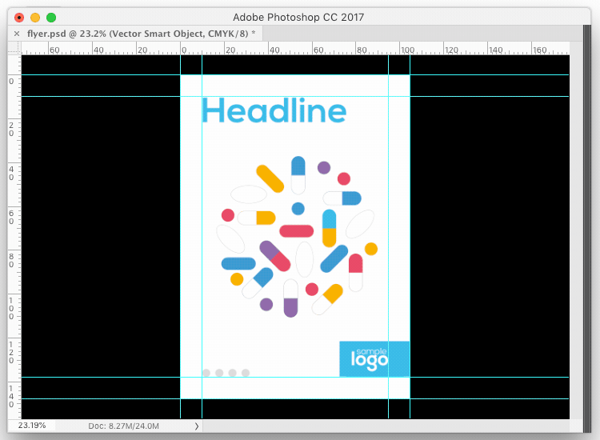

  

# Hi everybody :)
This is a collection of JSX scripts for Adobe Photoshop. All scripts created by me, sometimes used part of the code of other authors.  

The descriptions for each file can be found in the file's header text. Test environment: Photoshop CC 2018 (Win), CC 2017 (Mac OS).   

### Installation 

1. [Download archive] and unzip. All scripts are in the folder `jsx`
2. Place `<script_name>.jsx` in the Photoshop Scripts folder:
	- OS X: `/Applications/Adobe Photoshop [version]/Presets/Scripts/`
	- Windows (32 bit): `C:\Program Files (x86)\Adobe\Adobe Photoshop [version]\Presets\Scripts\`
	- Windows (64 bit): `C:\Program Files\Adobe\Adobe Photoshop [version] (64 Bit)\Presets\Scripts\`
3. Restart Photoshop
4. You can also setup a custom hotkey in `Edit → Keyboard Shortctus…`

[Download archive]: http://bit.ly/2wLaIkq 

### Donate (optional)
If you find this script helpful, consider shouting me coffee ☕️ via [PayPal] or [Yandex Money] 🙂  

[PayPal]: https://paypal.me/osokin/2usd
[Yandex Money]: https://money.yandex.ru/to/410011149615582
  

# TIFF2Print 1.0

Simple script to save a print ready file in Photoshop.   

### Features
* Adding width and height (mm) in file name   
* Shorten measure units (cm/m) when possible   
* Save the preview image with the file for printing   
* Auto adding an index to the name, to save multiple files   
* Parameters are easily configured in the script code   

### Usage

1. Open your file or create new
2. Run script `File → Scripts → TIFF2Print`
3. Select the options in the dialog window & click `Ok` button

 

 

### Don't forget sharing link with a friend 🙂 

### Contribute

Found a bug? Please [submit a new issues](https://github.com/creold/photoshop-scripts/issues) on GitHub.

### Contact
Email <hi@sergosokin.ru>  

### License

All scripts is licensed under the MIT licence.  
See the included LICENSE file for more details.